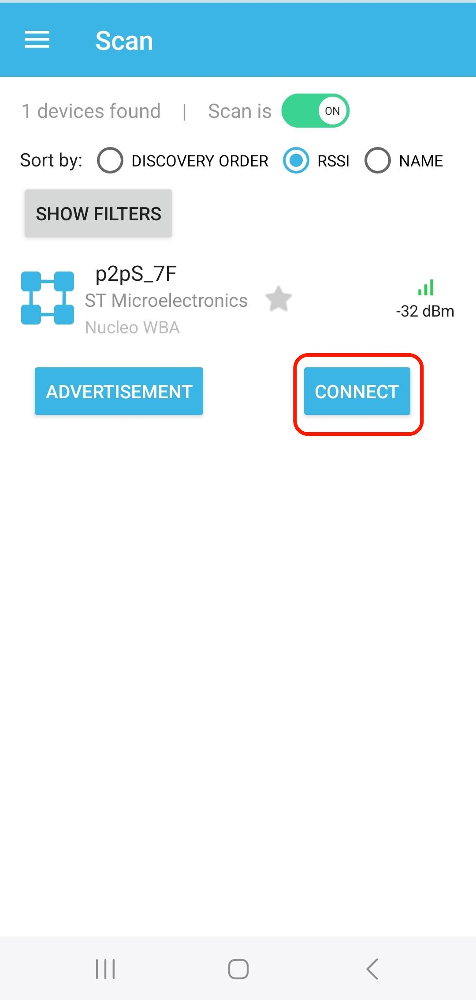
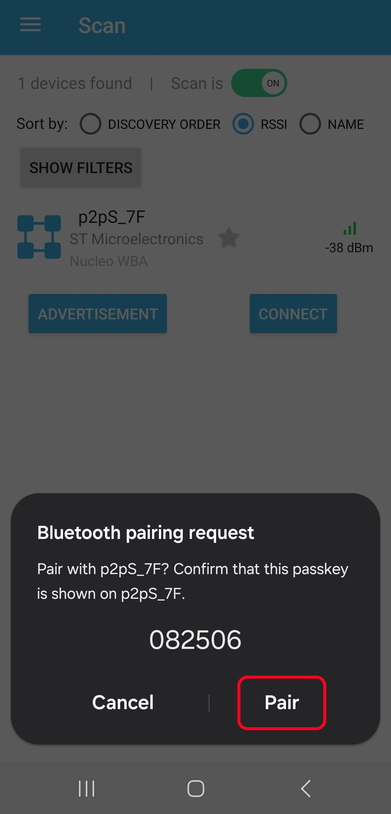
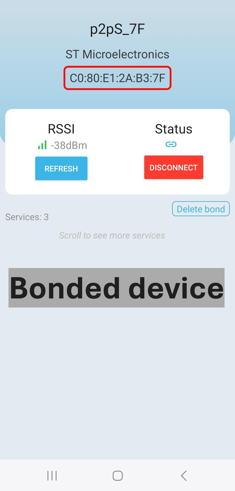
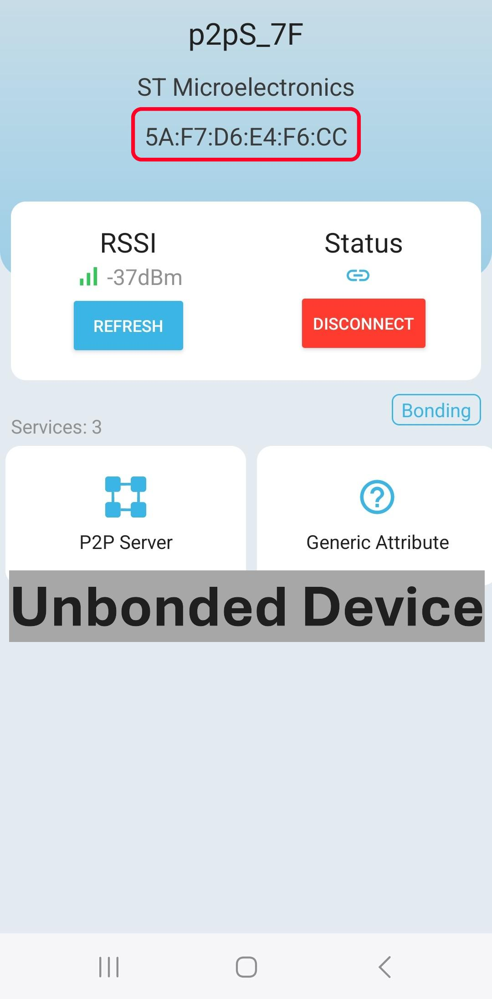

# STM32WBA BLE Privacy

How to use a Resolvable Private Address (RPA) to prevent tracking of a beacon device by its BLE address.

## Application Description

This **STM32WBA-BLE-Privacy** application utilizes the Nucleo board to demonstrate an implementation of the Resolvable Private Address (RPA) feature.

For more information regarding the BLE Privacy functioning, please visit: <a href="https://wiki.st.com/stm32mcu/wiki/Connectivity:STM32WB-WBA_BLE_Privacy"> BLE Privacy Wiki </a>
documentation.

### **Keywords**

Connectivity, BLE, BLE protocol, BLE pairing, Resolvable Private Address.

### **Hardware and Software environment**

- This example runs on STM32WBA55xx Nucleo.
- Connect the Nucleo Board to your PC with a USB cable type A to type C to ST-LINK connector (USB_STLINK).

### **How to use it?**

In order to make the program work, you must do the following:

- Open IAR toolchain
- Rebuild all files and flash the board with the executable file

- Buttons utilities on both Client/Server.
  Button | BLE_Client_Privacy | BLE_Server_Privacy
  :-------------------------:|:-------------------------:|:-------------------------:
  Button 1 (Short press) : B1S | Scan without connect | Start advertise
  Button 1 (Long press) : B1L| Scan and try to connect | Start advertise
  Button 2 : B2 | Clear database | Clear database
  Button 3 : B3 | Allow RPA resolution by the stack | /

Power on the Nucleo boards with the BLE_Client_Privacy and BLE_Server_Privacy applications.
Then press B2 on both Client and Server boards, wait the end of task and reset both boards.

This following sequence demonstrate how the Privacy have been implemented :

- B1 on Server : Start adv for 10 secondes
- B1S on Client : Scan all the device that advertise
- B1L on Client : Scan and connect to the server. After that a pre-programmed sequence will be done :
  - Start connection
  - Start pairing/bonding
  - Start Encryption
  - Start disconnection
  - Once disconnect, Client and server will add the device bonded to their respective resolving list, which allow to automaticly resolve the RPA at the stack level.
- B1 on Server : the server start to advertise with the RPA. This one evolve each 10 secondes, which means that a different BD (Bluetooth Device) address is used to advertise each 10 secondes. This has been set up using the hci_le_set_resolvable_private_address_timeout() function. When the server start to advertise, the current RPA is printed. Unfortunatly, if this one evolves during the advertise interval (10 sec), the new one isn't printed.
- B1S Client : the Client is able to resolve the RPA, and both the BD address as well as the RPA are printed. As explained before, the RPA can change during the scan interval (1 sec).
- B3 on Client : disable RPA resolution by the stack
- B1S on Server & Client : the client is no more able to detect the RPA and to retrieve the real BD address.

## Step-by-step Guide (WBA server and Smartphone client)
- Open IAR toolchain
- Rebuild all files and flash the board with the executable file
- Open ST BLE Toolbox application
- Push B1 on server in order to start advertising
- Perform scan in ST BLE Toolbox and search for "p2pS_7F"

- After connection, pairing/bonding is automatically performed 

- After disconnection, server will add client to the resolving list
- Since then, when server is advertising, it will advertise RPA (for unbonded devices) instead of Random Static Address

 

## Troubleshooting

**Caution** : Issues and the pull-requests are **not supported** to submit problems or suggestions related to the software delivered in this repository. The STM32WBA BLE_ANCS_AMS_HeartRate example is being delivered as-is, and not necessarily supported by ST.

**For any other question** related to the product, the hardware performance or characteristics, the tools, the environment, you can submit it to the **ST Community** on the STM32 MCUs related [page](https://community.st.com/s/topic/0TO0X000000BSqSWAW/stm32-mcus).
